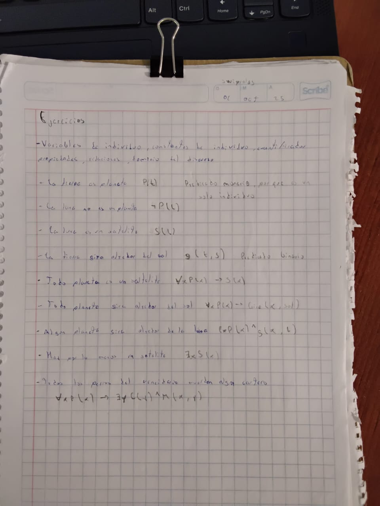

# Prolog

## Indice

- [Mi Repositorio](README.md)
    - [Indice](#indice)
        - [Introduccion](README.md)
         - [Clisp](Clisp.md)
         - [Prolog](Prolog.md)
         - [Proyecto Final]()

---

### **Logica de primer orden**

Constante de individuo son aquellas que nos hace una referencia en especifico

Variables de individuo que hacen referencias a entidades referidas

---

Unificacion de prolog

factorial(0, 1).
factorial(X, F):- X1 is X - 1,
factorial(X1 , F1), F is X * F1.

Fibonacci 
Multiplicacion con sumas
Divicion con resta
