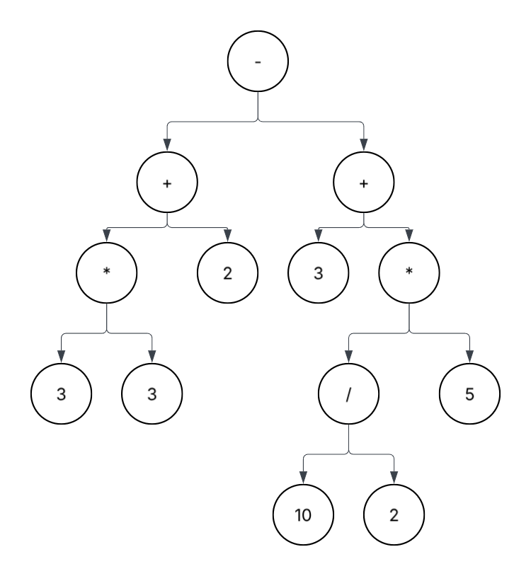
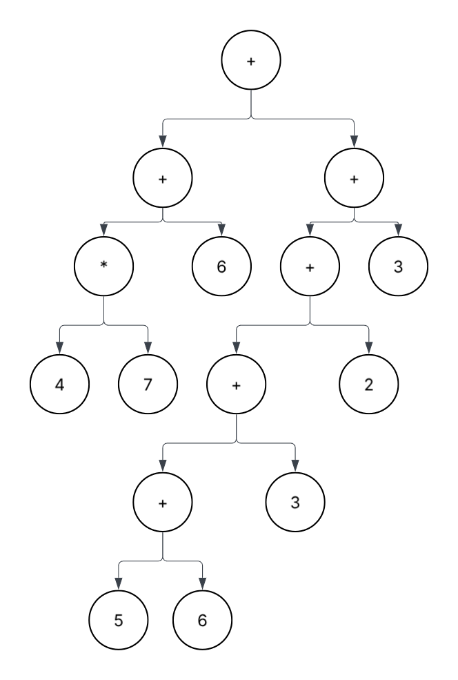
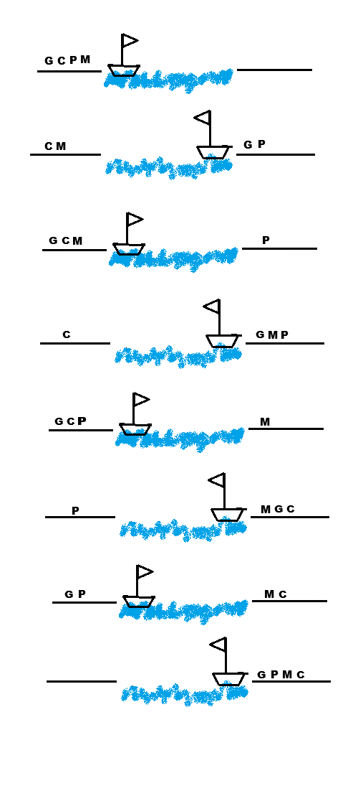
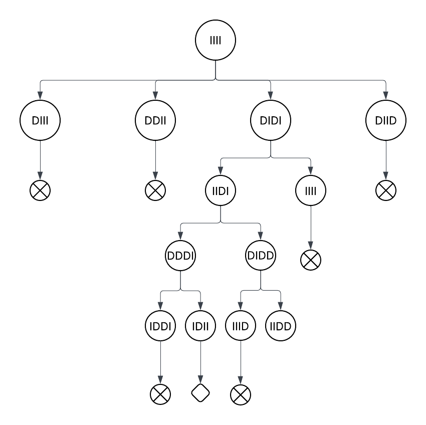

# UNIDAD 1

## Indice

- [Mi Repositorio](README.md)
    - [Indice](#indice)
        - [Unidad 1](#unidad-1)
            - [Estilos de Programacion](#estilos-de-programacion)
         - [Unidad 2]()
         - [Unidad 3]()
         - [Unidad 4]()


---

### **Estilos de programacion**

-  ***camelCase:*** 

    El caso camello es una convención de nomenclatura en la que varias palabras se unen sin espacios, y cada palabra comienza con una letra mayúscula excepto la primera palabra. Este estilo se usa comúnmente en programación para nombrar variables, funciones y métodos.

    En el caso del camello, la primera palabra se escribe en minúsculas y cada palabra posterior comienza con una letra mayúscula. Esto hace que las "jorobas" de las letras mayúsculas se parezcan a las jorobas de un camello, de ahí el nombre. Por ejemplo:

    ```
    numberOfDonuts = 34
    favePhrase = "Hello World"
    ```

- ***snake_case:***

    El caso de serpiente es una convención de nomenclatura en la que cada espacio de una frase se reemplaza con un carácter de subrayado ( _ ) y todas las palabras se escriben en minúsculas. Este estilo se usa a menudo para nombres de variables y métodos en programación, así como para nombres de archivos.

    ```
    number_of_donuts = 34
    fave_phrase = "Hola mundo"
    ```

---

### **CLisp**

#### **Aritmetica Preorden**

3 * 3 + 2 - 3 + 10 / 2  5

Arbol Binario



6 + 6 + 3 * 5 * 6 + 10 + 2 - 3


7 + 7 * 3 + 1 + 6 * 3 + 10 / 2


6 + 4 * 7 + 5 + 6 + 3 + 2 - 3


**Actividad**   03/09/25

a)  `6 + 4 * 7 + 5 + 6 + 3 + 2 - 3`



b) `6 + 12 + 9 + 8 * 3 * 6 * 2 + 2`


c) `6 / 2 * 5 + 6 * 3 + 9 + 8 + 9`

Implementar una funcion que valide la siguiente cadena

a) `( ( ) ) ) ( ( )`

b) `( ( ) ) ( ) ( ) )`

c) `( ) ( ) ) ( ( ) )`

d) `( ( ( ) ) ) ( ) ( )`

Prueba de escritorio

```
int f(int x)
{
    if (x>100)
    {
    return (x-10);
    }
    else {
        retrun(f(f(x+1)));
    }
}
```

Implementar un algoritmo que imprima todas las posibles descomposiciones de un numero natal como suma de numeros menores que el.
ejemplo: 5
    1+1+1+1+1
    2+2+1
    3+2
    3+1+1
    2+1+1+1

---
#### **Funciones Clisp**

- Unless

- Let

- Cdr

- Setq

- Setf

- Format

- Princ

- Read

- Read-Line

- mapcar

- assoc 
```
 (defparameter *nodes* '((living-room (you are in the living-room.
  a wizard is snoring loudly on the couch.))
    (garden (you are in a beautiful garden.
  there is a well in front of you.))
    (attic (you are in the attic.
  there is a giant welding torch in the corner.))))

  > (assoc 'garden *nodes*)
 (GARDEN (YOU ARE IN A BEAUTIFUL GARDEN. THERE IS A WELL IN FRONT OF YOU.))
 ```

    ``Funcion que captura lo que escriba el usuario``

- Case

- Car 

- Append 

- When 

---
#### **Funciones Definidas de cdr y car** (maneja cualquier tipo de dato)

```lisp
car  <- Cabeza de la lista
>(car '(1 2 3 4 5))
>1

cdr  <- Cola de la lita
>(cdr '(1 2 3 4 5))
>(2 3 4 5)

caar 
>(caar '((1) 2 3 4 5))
>(1)

cadr
>(cadr '((1) 2 3 4 5))
>2

```
**Actividad**


1) ``(a b (d l) (c x) m n)``

    1. ``>(d l)``
      
        ``>(cadddr '(a b (d l) (c x) m n))``

    2. ``>x``

        ``(car(cdr(car)cddddr '(a b (d l) (c x) m n)))``

    3. ``>d``
        
        ``(car(cadddr '(a b (d l) (c x) m n)))``


2) ``(a b c (d) c f ((g h)) i j k)``

    1. ``>k``

        ``(cadr (cddddr (cddddr '(a b c (d) c f ((g h)) i j k))))``

    2. ``>g``

        ``(car (caaddr (cddddr '(a b c (d) c f ((g h)) i j k))))``

    3. ``>d``

        ``(car (cadddr '(a b c (d) c f ((g h)) i j k)))``

    4. ``>b``

        ``(cadr '(a b c (d) c f ((g h)) i j k))``

3) ``(((a b c d)) 1 (2) 3 (4 5) (6 (7) 8))``

    1. ``>b``

        ``(cadr (caar '(((a b c d)) 1 (2) 3 (4 5) (6 (7) 8))))``

    2. ``>d``

        ``cadddr (caar '(((a b c d)) 1 (2) 3 (4 5) (6 (7) 8)))``

    3. ``>2``

        ``(caaddr '(((a b c d)) 1 (2) 3 (4 5) (6 (7) 8)))``

    4. ``>7``

        ``(caadr (caadr (cddddr '(((a b c d)) 1 (2) 3 (4 5) (6 (7) 8)))))``

    5. ``>5``

        ``(cadar (cddddr '(((a b c d)) 1 (2) 3 (4 5) (6 (7) 8))))``

    6. ``>4``

        ``(caar (cdddr '(((a b c d)) 1 (2) 3 (4 5) (6 (7) 8))))``
---
#### **Palabras reservadas if , prong, when, unless, cond**

```lisp
(if ()
    -V     Solo imprime dos lineas de if
    -F
)
(if ()
    (progn
        -princ / format      Con el progn puedes hacer mas funciones
        -V
    )
    -F
)
(when ()
                Con el when puedes hacer mas acciones como si tuviera el progn
)
(unless ()
        Negacion de la condicion, hace la accion si es lo contrario a la negacion
)

(cond ()

)

```


**Actividad**

1.- Que calcule el sueldo que le corresponde al trabajador de una
empresa que cobra 40.000 euros anuales, el programa debe realizar los
cálculos en función de los siguientes criterios:

- Si lleva más de 10 años en la empresa se le aplica un aumento del 10%.
- Si lleva menos de 10 años pero más que 5 se le aplica un aumento del
  7%.
- Si lleva menos de 5 años pero más que 3 se le aplica un aumento del
  5%.
- Si lleva menos de 3 años se le aplica un aumento del 3%.()

2.- Hacer un algortimo que tome el peso en libras de una cantidad de
ropa a lavar en una lavadora y nos devuelva el nivel dependiendo del
peso; además nos informe la cantidad de litros de agua que
necesitamos. Se sabe que con más de 30 libras la lavadora no funcionara
ya que es demasiado peso. Si la ropa pesa 22 ó más libras, el nivel será
de máximo; si pesa 15 ó más nivel será de alto; si pesa 8 ó más será un
nivel medio o de lo contrario el nivel será minimo

3.- Martha va a realizar su fiesta de quince años. Por lo cual ha
invitado a una gran cantidad de personas. Pero también ha decidido
algunas reglas: Que todas las personas con edades mayores a los quince
años, sólo pueden entrar si traen regalos; que jóvenes con los quince
años cumplidos entra totalmente gratis pero los de menos de quince años
no pueden entrar a la fiesta. Hacer un algoritmo donde se tome la edad
de una persona y que requisito de los anteriores le toca cumplir si
quiere entrar.

```lisp 
(defun ejercicio1 (nombre a)
  (when(>= a 10)
    (format t "Hola, ~a~%" nombre)
    (format t "Tu aumento anual ~a Por tener ~a anos en la empresa ~%" (* 40000 0.1) a )
  )
  (when(and (< a 10) (>= a 5))
    (format t "Hola, ~a~%" nombre)
    (format t "Tu aumento anual ~a Por tener ~a anos en la empresa ~%" (* 40000 0.07) a )
  )
  (when(and (< a 5) (>= a 3))
    (format t "Hola, ~a~%" nombre)
    (format t "Tu aumento anual ~a Por tener ~a anos en la empresa ~%" (* 40000 0.05) a )
  )
  (when (< a 3)
    (format t "Hola, ~a~%" nombre)
    (format t "Tu aumento anual ~a Por tener ~a anos en la empresa ~%" (* 40000 0.03) a )
  )
)

(defun ejercicio2 (a)
  (when (>= a 30)
  (format t "ALERTA ~%" )
  (format t "Limite exedido:  ~a libras ~%" a )
  )
  (when (and (>= a 22) (< a 30))
  (format t "Esta en su limite maximo:  ~a libras ~%" a )
  )
  (when (and (>= a 15) (< a 22))
  (format t "Esta en su limite alto:  ~a libras ~%" a )
  )
  (when (and (>= a 8) (< a 15))
  (format t "Esta en su limite medio:  ~a libras ~%" a )
  )
  (unless (>= a 8)
  (format t "Esta en su limite minimo:  ~a libras ~%" a )
  )
)

(defun ejercicio3 (a)
  (when (> a 15)
      (format t "Puedes entrar pero con regalo ~%" )
  )
  (when (= a 15)
      (format t "Puedes entrar totalmente gratis ~%" )
  )
  (unless (>= a 15)
    (format t "No esta permito tu pase a a la fiesta ~%" )
  )
)

```

---
#### **Introduccion a CLisp**

Para ejecutar Clisp en la ventana de comandos
``(load "nombreArchivo.lsp")`` y despues iniciamos la ejecucion del cualquier funcion ``(nombreFuncion "parametros")``

```lisp
(defun suma(a b)
  (+ a b)
)

(defun areacuadro(a b)
  (* a b)
)

(defun factorial (x)
  (if (= x 0)
    1
    (* x (factorial(- x 1)))
  )
)

(defun finbonacci (x)
  (if (< x 2)
    1
    (+ (finbonacci (- x 1)) (finbonacci (- x 2)))

  )
)

;potencia con sumas
(defun potencia (x y)
  (if (= y 0)
      1
      (* x (potencia x (- y 1)))))


;Divicion con resta
(defun divicion (a b)
    (if (= a 0)
      0
      (- divicion(a) b)
    )

)

(defun holamundo ()
 ;(princ "Hola mundo")
 (format nil "Hola mundo")
)


(defun recorre (lista)
  (setq elemento (car lista))
  (format t "El valor de la lista es ~D~% " elemento)
  (if lista
    (recorre (cdr lista))
  )
)

(defun evalua (a b)
  (if (< a b)
    (progn
    (format t "Evaluacion del if ~%") ; el format t imprime las dos lineas
    (format t "A < B")
    )
    (format nil "A > B") ;solo imprime esta linea con el format nil
  )
)

(defun saluda (nombre)
  (when (string = nombre "")
    (format t "Hola, -a!-%" nombre)
  )
)

(defun saludar(nombre)
  (cond ((eq nombre 'juan) '(hola juan)) ;con el cond me permite hacer validaciones
        ((eq nombre 'maria) '(hola maria))
        ((eq nombre 'nombre) '(hola lupe))
        (t '(no se quien seas))
  )
)

(defun saludarse(nombre)
  (case nombre
        ((juan) '(hola juan))
        ((maria) '(hola maria))
        ((lupe) '(hola lupe))
        (otherwise '(no se quien seas))
  )
)
```
---


#### **Actividad y  Ejercicios**

1.-Cuatro personas necesitan cruzar un puente de noche con un sola
linterna. El puente es frágil y solo puede soportar a dos personas a
la vez. Cada persona tarda diferentes tiempos en cruzar (1, 2 5 y 10
minutos).  Cuando dos personas cruzan, lo hacen al ritmo del más lento
¿Cómo pueden todos cruzar el puente en 17 minutos?

```

X₁= 1, X₂=2, X₃=5, X₄=10

V1=X₁ + X₂ = 3
V2=V1 + X₁ = 4
V3=V2 + X₁ + X₃ = 10

```


2.-En una calle hay cinco casas, cada una de un color distinto.  En cada
casa vive una persona de distinta nacionalidad.  Cada dueño bebe un
único tipo de bebida, fuma una sola marca de cigarrillos y tiene una
mascota diferente a sus vecinos.  A partir de las 15 pistas
presentadas a continuación, la consigna que hay que responder es:
"¿Quién es el dueño del pez?".

El británico vive en la casa roja.
El sueco tiene un perro como mascota.
El danés toma té.
El noruego vive en la primera casa.
El alemán fuma Prince.
La casa verde está inmediatamente a la izquierda de la blanca.
El dueño de la casa verde bebe café.
El propietario que fuma Pall Mall cría pájaros.
El dueño de la casa amarilla fuma Dunhill.
El hombre que vive en la casa del centro bebe leche.
El vecino que fuma Blends vive al lado del que tiene un gato.
El hombre que tiene un caballo vive al lado del que fuma Dunhill.
El propietario que fuma Bluemaster toma cerveza.
El vecino que fuma Blends viveal lado del que toma agua.
El noruego vive al lado de la casa azul.


**Problemas NP (problemas de juguete)**


El granjero,el coyote, el pollo y el maiz

iiii        DDDD

 


**Lista de Asociacion**

Es una lista dentro de una lista dentro de una lista

```lisp
(detparameter *nodes* '(
                          (femenino (
                                     (fuego (azula . "maestra fuego"))
                                     (tierra (top))
                                     (agua (karata))
                                    )
                          )
                         (masculino ( 
                                      (aire (Hola rayo masculino))
                                      (fuego (Hola fuego))
                                      (tierra (hola tierra))
                                      (agua (poder de agua))
                                    )
                         
                         )
                         (ovni (
                                (aire (alto))
                                (fuego (hola fuego))
                                (tierra (hola tierra))
                              )
                         
                         )
                       )
)
```
(Arboles de busqueda, busqueda a lo ancho)

---

**Actividad Arbol genealogico**

[arbolGenealogico](Codigo/arbologenalogico.lsp)


---
**Actividad De Funciones** 

[FuncionesAct](actividadesFunLog.pdf)

  1. **Problemas con car y cdr**

      ```
      Lista: (a b c d e) → d               R: (cadddr '(a b c d e))
      
      Lista: ((1 2) (3 4) (5 6)) → 5       R: (caaddr '((1 2) (3 4) (5 6)))

      Lista: ((a b) (c d) (e f)) → e       R: (caaddr '((a b) (c d) (e f)))

      Lista: ((x y) ((p q) (r s)) (z w)) → z  R: (caaddr '((x y) ((p q) (r s)) (z w)))

      Lista: ((1 (2 3)) (4 (5 6))) → 6     R: (cadr (cadadr '((1 (2 3)) (4 (5 6)))))

      Lista: (((a b) c) d e) → c           R: (cadar '(((a b) c) d e))

      Lista: (((1 2) 3) ((4 5) 6)) → 6     R: (cadadr '(((1 2) 3) ((4 5) 6)))

      Lista: ((p (q (r s))) t u) → (r s)   R: (car (cdadar '((p (q (r s))) t u)))

      Lista: (((a) b) (c (d e)) f) → d     R: (car (cadadr '(((a) b) (c (d e)) f)))

      Lista: ((1 (2 (3 4))) (5 6)) → 3     R: (caar (cdadar '((1 (2 (3 4))) (5 6))))

      Lista: (((x) (y)) ((z) (w))) → (w)   R: (cadadr '(((x) (y)) ((z) (w))))

      Lista: ((a (b (c d))) (e f)) → c     R: (caar (cdadar '((a (b (c d))) (e f))))

      Lista: ((1 (2 (3 (4 5)))) (6 7)) → 4 R: (caadar (cdadar '((1 (2 (3 (4 5)))) (6 7))))

      Lista: (((a b) c) ((d e) f) ((g h) i)) → g  R: (car (caaddr '(((a b) c) ((d e) f) ((g h) i))))

      Lista: (((x y) (z w)) ((p q)(r s))) → r   R:  (car (cadadr '(((x y) (z w)) ((p q)(r s)))))

      Lista: ((1 (2 (3 (4 (5 6))))) (7 8)) → 5  R:  (caar(cdadar (cdadar '((1 (2 (3 (4 (5 6))))) (7 8)))))

      Lista: ((a (b (c (d e)))) (f g)) → d  R: (caadar (cdadar '((a (b (c (d e)))) (f g))))

      Lista: (((1 2) (3 4)) ((5 6) (7 8))) → 7   R: (car (cadadr '(((1 2) (3 4)) ((5 6) (7 8)))))

      Lista: ((x (y (z (w v))))) → w  R: (caadar (cdadar '((x (y (z (w v)))))))

      Lista: (((a b c) (d e f)) ((g h i) (j k l))) → j  R: (car (cadadr '(((a b c) (d e f)) ((g h i) (j k l)))))

      ```


  2. **Ejercicios de lisp**

     2.1 Ejercicio 1

     Dada una lista de pares clave-valor, usar ‘assoc‘ para obtener el valor de la
     clave ‘’edad‘. Lista de ejemplo:

      (setq persona '((nombre . "Ana") (edad . 23) (ciudad . "Morelia")))

      Pregunta: ¿cómo obtener la edad con ‘assoc‘, ‘cdr‘ y ‘car‘?

      ```lisp
      (cdr (assoc 'edad persona))

      ```
      2.2 Ejercicio 2

       Usar ‘if‘ para escribir una función que diga si el primer elemento de una lista
       es un número positivo o no. Ejemplo:

       (mi-funcion '(5 3 2)) ; => "positivo"

       (mi-funcion '(-2 1 4)) ; => "no positivo"
       
       ```lisp
        (defun numpositivo (lista)
          (if (> (car lista) 0) 
                (format t "Es positivo el primer numero de la lista ~a ~%" (car lista))
                (format t "Es negativo el primer numero de la lista ~a ~%" (car lista))
          )
        )

        (defparameter *nodes* '(5 3 2))
       ```

---


### **Logica de primer orden**

Constante de individuo son aquellas que nos hace una referencia en especifico

Variables de individuo que hacen referencias a entidades referidas


---

∀